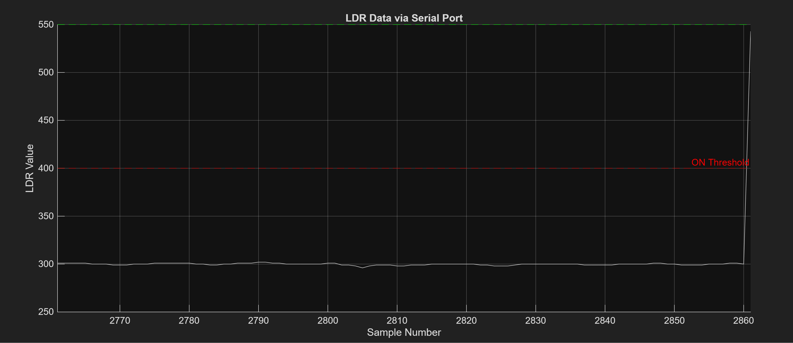
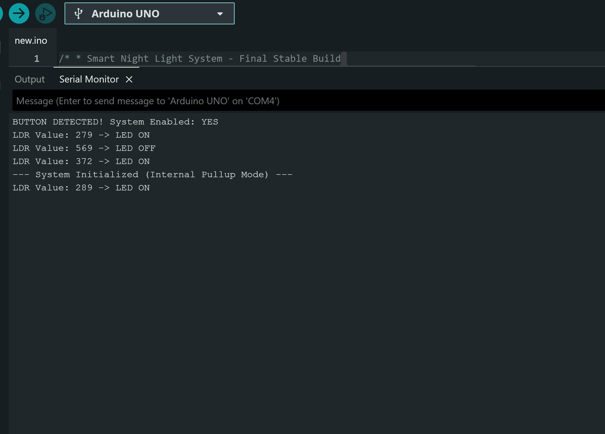
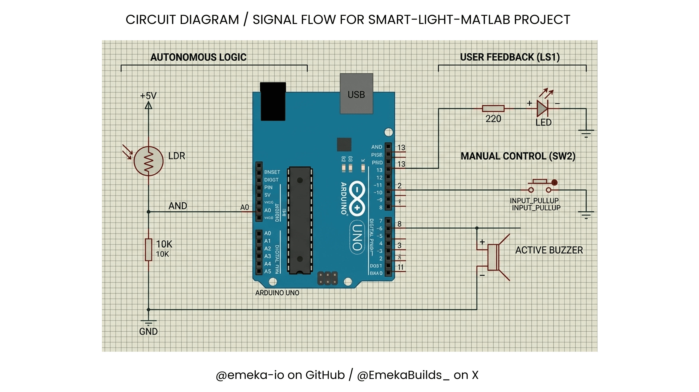

# Smart Light System: Real-Time Data Visualization Using MATLAB

This is an energy-efficient smart lighting project that uses a photoresistor (LDR) to automate LED states. This project bridges hardware and software by using **MATLAB** to visualize millisecond light fluctuations and **Arduino** for embedded control.

## Live Demo
See it in action here: [Link to my X post](https://x.com/EmekaBuilds_/status/2046893422976348191?s=20)

## Project Overview
The core idea is simple: **To save energy.** The LED stays ON only when the environment is dark. However, I added "Human Control" using a physical button (manual override) for situations where you want the light off even in the dark (e.g., when watching a movie).

## Data Visualization
To understand how the system "thinks," I used MATLAB to plot the raw data against a defined threshold.

### 1. Threshold Analysis (MATLAB)

*This graph plots the LDR value against runtime. Using my threshold range as a reference, the **Red Dashed Line** represents my 'ON Threshold' while the **Green Dashed Line** represents my 'OFF Threshold'. When the white line (current light level) crosses these thresholds, the system triggers the LED state change.*

### 2. Embedded Logic (Raw data from the Serial Monitor)

*The raw data stream shows the system's responsiveness. You can see the moment the **BUTTON DETECTED!** message appears, enabling the system, and how the LDR values immediately translate to LED states (ON/OFF).*

## Hardware Setup
The system consists of:
* **Microcontroller:** Arduino UNO
* **Input:** Photoresistor (LDR) + Push Button (Manual Override)
* **Output:** LED
* **Logic:** Voltage divider circuit for light sensing.

## Circuitry & Wiring
To bring this project to life, I designed a voltage divider circuit to translate the LDR's resistance into a readable voltage for the Arduino.

*Figure 1: Circuit schematic showing the LDR voltage divider, the LED output, and the pull-up configuration for the manual override button.*

*Figure 2: The physical breadboard wiring. Note the placement of the LDR and the manual switch for ergonomic access.*
 
## Engineering Insights
Building this project taught me that real-world light levels are never a constant value; they change within milliseconds. 

**Challenges Overcome:**
- **Patience with Wiring:** Sometimes the code is perfect, but a loose jumper wire makes the system fail. Constant tweaking was required to get a clean signal.
- **Data Noise:** Millisecond fluctuations can cause "flickering." Visualizing the data helped me set a stable threshold to prevent this.

## Repository Structure
- `/src/arduino`: Embedded C++ code for the Arduino UNO.
- `/src/matlab`: `.m` scripts for real-time plotting.
- `/assets`: GIFs and images for documentation.
- `/info/bill_of_materials.md`: Full list of hardware parts.
- `/info/schematic.png`: Circuit Diagram for the project.

---
*Developed by Emeka | Mechatronics Engineering Student | April 2026*
